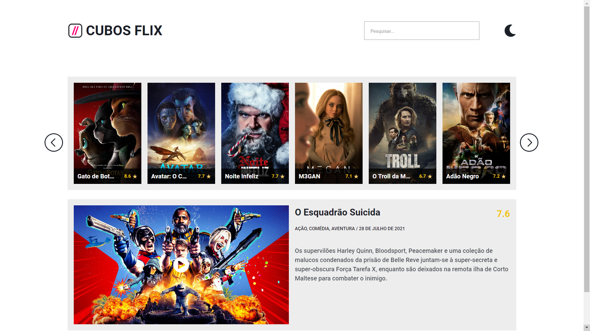
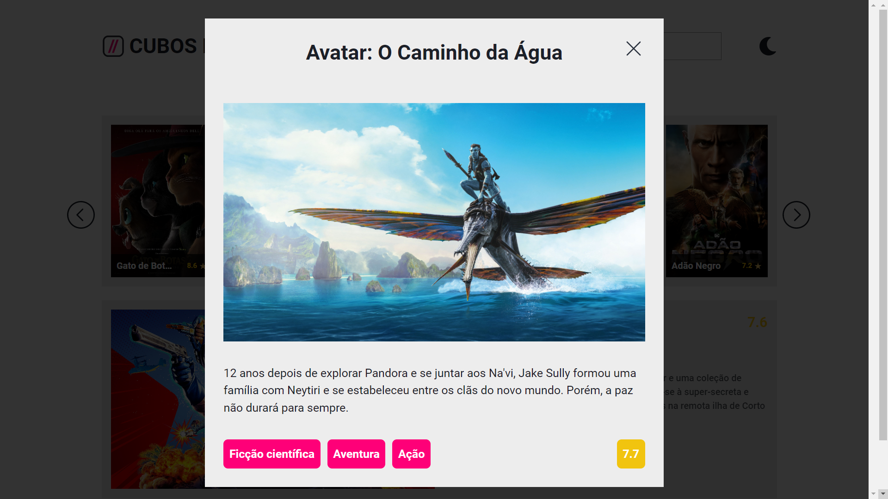

## 📌 Desafio Cubos Flix

Desafio do final do segundo módulo do curso da <a target="_blank" href="https://cubos.academy/">**Cubos Academy**</a>. O objetivo era criar todas as funcionalidades do site, sendo manipulação da DOM e integração com uma API de filmes, de acordo com o modelo no Figma, que pode ser visualizado no arquivo **'Desafio Módulo 2 - 2.0.fig'**.

É importante destacar que os arquivos HTML e CSS já vieram prontos, porém tudo que está dentro da pasta JS foi desenvolvido por mim.

O que foi realizado:
- Visualização de filmes
- Paginação de filmes
- Busca de filmes
- "Filme do dia"
- Modal de filme
- Mudança de tema

#### 👉🏼 <a target="_blank" href="https://cubos-flix-challenge.netlify.app/">**VISUALIZE O PROJETO**</a>

## 🛠 Ferramentas

## ✒️ Visual

Feito com 💜 por <a target="_blank" href="https://www.linkedin.com/in/mi-santana/">Milena Santana</a> 😊

